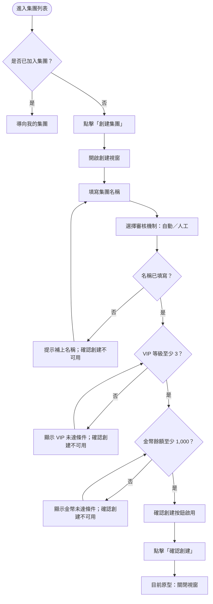

# 創建集團流程圖

依目前創建集團前端原型整理。創建條件為 VIP 3 以上、金幣餘額至少 1,000，並須填寫集團名稱；審核機制可選自動或人工。

```mermaid
flowchart TD
  A([進入集團列表]) --> B{是否已加入集團？}
  B -- 是 --> C[導向我的集團]
  B -- 否 --> D[點擊「創建集團」]
  D --> E[開啟創建視窗]
  E --> F[填寫集團名稱]
  F --> G[選擇審核機制：自動／人工]
  G --> H{名稱已填寫？}
  H -- 否 --> I[提示補上名稱；確認創建不可用]
  I --> F
  H -- 是 --> J{VIP 等級至少 3？}
  J -- 否 --> K[顯示 VIP 未達條件；確認創建不可用]
  K --> J
  J -- 是 --> L{金幣餘額至少 1,000？}
  L -- 否 --> M[顯示金幣未達條件；確認創建不可用]
  M --> L
  L -- 是 --> N[確認創建按鈕啟用]
  N --> O[點擊「確認創建」]
  O --> P[目前原型：關閉視窗]
```

> 原型現況：送出表單目前只關閉視窗，尚未串接實際建立集團、扣除 1,000 金幣或成功回饋；正式流程需由後續服務邏輯完成。
